# yudao-framework 模块说明文档

## 概述

`yudao-framework` 是框架的核心封装模块，采用 **Spring Boot Starter** 模式，将各种技术组件封装成可插拔的 Starter，实现开箱即用。

**核心价值：**
- 技术组件封装：将 MyBatis、Redis、Security 等组件封装成 Starter
- 自动配置：基于 Spring Boot 自动配置机制，零配置使用
- 统一规范：提供统一的 API 和工具类，规范开发方式
- 业务组件：封装多租户、数据权限等业务通用能力

## 模块结构

```
yudao-framework/
├── yudao-common/                          # 基础通用模块
├── yudao-spring-boot-starter-web/         # Web 框架封装
├── yudao-spring-boot-starter-security/    # 安全框架封装
├── yudao-spring-boot-starter-mybatis/     # MyBatis 封装
├── yudao-spring-boot-starter-redis/       # Redis 封装
├── yudao-spring-boot-starter-websocket/   # WebSocket 封装
├── yudao-spring-boot-starter-job/         # 定时任务封装
├── yudao-spring-boot-starter-mq/          # 消息队列封装
├── yudao-spring-boot-starter-monitor/     # 监控封装
├── yudao-spring-boot-starter-protection/  # 服务保障封装
├── yudao-spring-boot-starter-excel/        # Excel 封装
├── yudao-spring-boot-starter-test/         # 测试封装
├── yudao-spring-boot-starter-biz-tenant/   # 多租户业务组件
├── yudao-spring-boot-starter-biz-data-permission/  # 数据权限业务组件
└── yudao-spring-boot-starter-biz-ip/       # IP 解析业务组件
```

## 实现原理

### Spring Boot Starter 模式

每个 Starter 模块都遵循 Spring Boot Starter 规范：

1. **自动配置类**：使用 `@AutoConfiguration` 和 `@ConditionalOnXxx` 注解
2. **配置属性类**：使用 `@ConfigurationProperties` 绑定配置
3. **自动装配**：通过 `META-INF/spring/org.springframework.boot.autoconfigure.AutoConfiguration.imports` 注册

**自动配置流程：**

```mermaid
graph TB
    A[Spring Boot 启动] --> B[扫描 AutoConfiguration.imports]
    B --> C[加载 AutoConfiguration 类]
    C --> D{@ConditionalOnXxx}
    D -->|条件满足| E[创建 Bean]
    D -->|条件不满足| F[跳过]
    E --> G[注册到容器]
    G --> H[功能可用]
    
    style A fill:#e1f5ff
    style D fill:#ffe1e1
    style E fill:#fff4e1
    style H fill:#e1f5ff
```

### 模块结构

每个 Starter 模块通常包含：

```
yudao-spring-boot-starter-xxx/
├── src/main/java/
│   └── cn/iocoder/yudao/framework/
│       └── xxx/
│           ├── config/          # 配置类
│           │   └── YudaoXxxAutoConfiguration.java
│           └── core/            # 核心实现
│               ├── handler/     # 处理器
│               ├── filter/      # 过滤器
│               └── util/        # 工具类
└── src/main/resources/
    └── META-INF/
        └── spring/
            └── org.springframework.boot.autoconfigure.AutoConfiguration.imports
```

## 各子模块详细说明

### yudao-common（基础通用模块）

#### 作用

提供项目的基础通用类，包括：
- **POJO 类**：通用返回结果、分页参数、基础实体等
- **枚举类**：通用状态枚举、用户类型枚举等
- **工具类**：JSON 工具、对象工具、验证工具等
- **异常类**：统一异常定义和错误码
- **业务接口**：框架与业务模块的接口定义

#### 核心类

| 类名 | 作用 |
|------|------|
| `CommonResult<T>` | 统一 API 返回结果封装 |
| `PageResult<T>` | 分页结果封装 |
| `PageParam` | 分页参数封装 |
| `BaseDO` | 数据库实体基类 |
| `JsonUtils` | JSON 序列化/反序列化工具 |
| `ServiceException` | 业务异常类 |
| `ErrorCode` | 错误码接口 |

#### 使用示例

```java
// 使用 CommonResult 返回结果
@GetMapping("/list")
public CommonResult<List<UserVO>> list() {
    List<UserVO> users = userService.list();
    return CommonResult.success(users);
}

// 使用 ServiceException 抛出业务异常
if (user == null) {
    throw ServiceExceptionUtil.exception(ErrorCodeConstants.USER_NOT_EXISTS);
}
```

#### 实现原理

`yudao-common` 是一个基础工具模块，不依赖 Spring 容器，采用纯 Java 实现：

1. **POJO 类设计**：使用泛型和 Builder 模式，提供类型安全的 API
2. **异常体系**：基于 `ErrorCode` 接口和 `ServiceException` 实现统一异常处理
3. **工具类封装**：优先使用 Hutool，不足时自行封装
4. **线程安全**：使用 `TransmittableThreadLocal` 解决父子线程传值问题

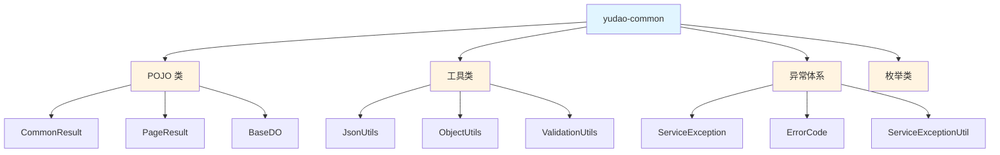

#### 配置说明

无需配置，直接引入依赖即可使用。

---

### yudao-spring-boot-starter-web（Web 框架封装）

#### 作用

封装 Web 相关功能，包括：
- **全局异常处理**：统一异常捕获和响应
- **全局响应处理**：统一 API 响应格式
- **API 日志**：自动记录 API 访问日志
- **数据脱敏**：敏感数据自动脱敏
- **XSS 防护**：防止 XSS 攻击
- **API 加密**：请求/响应数据加密
- **Swagger/Knife4j**：API 文档自动生成

#### 核心功能

##### 全局异常处理

```java
@RestControllerAdvice
public class GlobalExceptionHandler {
    // 自动捕获并处理所有异常
    @ExceptionHandler(ServiceException.class)
    public CommonResult<?> serviceExceptionHandler(ServiceException ex) {
        return CommonResult.error(ex.getCode(), ex.getMessage());
    }
}
```

##### 全局响应处理

所有 Controller 方法的返回值自动包装为 `CommonResult`：

```java
@GetMapping("/user/{id}")
public UserVO getUser(@PathVariable Long id) {
    // 返回值自动包装为 CommonResult<UserVO>
    return userService.getUser(id);
}
```

##### API 日志

使用 `@ApiAccessLog` 注解记录 API 访问日志：

```java
@ApiAccessLog(operateType = OperateTypeEnum.GET)
@GetMapping("/user/{id}")
public UserVO getUser(@PathVariable Long id) {
    return userService.getUser(id);
}
```

##### 数据脱敏

使用脱敏注解自动脱敏敏感数据：

```java
public class UserVO {
    @MobileDesensitize  // 手机号脱敏
    private String mobile;
    
    @IdCardDesensitize  // 身份证脱敏
    private String idCard;
}
```

##### XSS 防护

自动过滤请求参数中的 XSS 攻击代码。

##### API 加密

使用 `@ApiEncrypt` 注解实现请求/响应加密：

```java
@ApiEncrypt
@PostMapping("/user")
public CommonResult<Long> createUser(@RequestBody UserCreateReqVO reqVO) {
    // 请求自动解密，响应自动加密
    return CommonResult.success(userService.createUser(reqVO));
}
```

#### 实现原理

Web Starter 通过 Spring MVC 的扩展点和过滤器链实现功能：

1. **自动配置**：`YudaoWebAutoConfiguration` 注册各种 Bean
2. **过滤器链**：通过 `FilterRegistrationBean` 注册过滤器，按顺序执行
3. **全局异常处理**：`@RestControllerAdvice` + `@ExceptionHandler` 统一捕获异常
4. **响应处理**：`ResponseBodyAdvice` 拦截 Controller 返回值
5. **数据脱敏**：Jackson 自定义序列化器实现

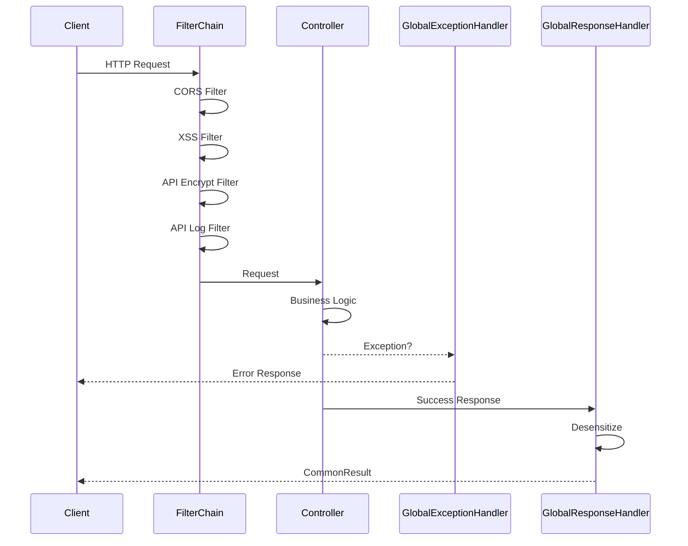

**过滤器执行顺序：**

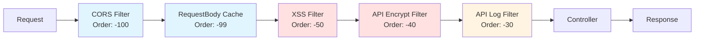

#### 配置说明

在 `application.yaml` 中配置：

```yaml
yudao:
  web:
    # API 日志配置
    api-log:
      enable: true
      ignore-urls:
        - /admin-api/system/auth/login
        - /admin-api/system/auth/logout
    
    # XSS 配置
    xss:
      enable: true
      ignore-urls:
        - /admin-api/system/file/upload
    
    # API 加密配置
    api-encrypt:
      enable: false
      secret: your-secret-key

# Swagger 配置
springdoc:
  api-docs:
    enabled: true
  swagger-ui:
    enabled: true
knife4j:
  enable: true
```

#### 依赖引入

```xml
<dependency>
    <groupId>cn.iocoder.boot</groupId>
    <artifactId>yudao-spring-boot-starter-web</artifactId>
</dependency>
```

---

### yudao-spring-boot-starter-security（安全框架封装）

#### 作用

封装 Spring Security，提供：
- **用户认证**：JWT Token 认证
- **权限校验**：基于注解的权限控制
- **操作日志**：自动记录操作日志

#### 核心功能

##### 权限校验

使用 `@PreAuthorize` 注解进行权限校验：

```java
@PreAuthorize("@ss.hasPermi('system:user:list')")
@GetMapping("/list")
public CommonResult<PageResult<UserVO>> list(@Valid PageParam pageParam) {
    return CommonResult.success(userService.getUserPage(pageParam));
}
```

##### 操作日志

使用 `@OperateLog` 注解记录操作日志：

```java
@OperateLog(type = OperateTypeEnum.CREATE, name = "创建用户")
@PostMapping("/create")
public CommonResult<Long> createUser(@RequestBody UserCreateReqVO reqVO) {
    return CommonResult.success(userService.createUser(reqVO));
}
```

#### 实现原理

Security Starter 基于 Spring Security 扩展，实现 JWT 认证和权限控制：

1. **自动配置**：`YudaoSecurityAutoConfiguration` 配置 Security 组件
2. **Token 认证**：`TokenAuthenticationFilter` 拦截请求，验证 JWT Token
3. **权限校验**：`@PreAuthorize` 通过 AOP 拦截，调用 `SecurityFrameworkService` 校验权限
4. **上下文传递**：使用 `TransmittableThreadLocalSecurityContextHolderStrategy` 解决异步线程上下文传递
5. **操作日志**：基于 `bizlog-sdk` 的 AOP 实现，自动记录操作日志

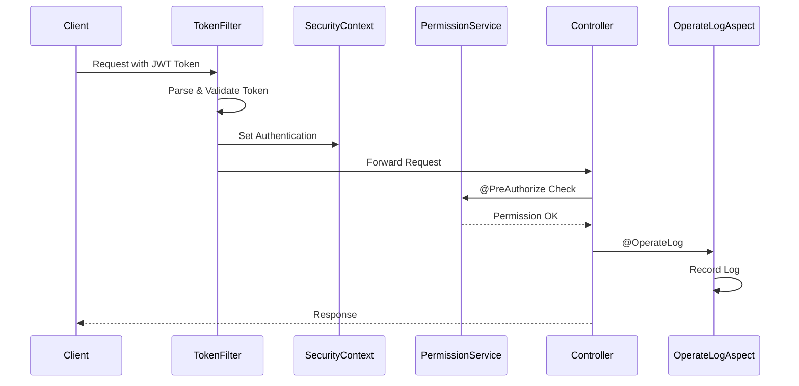

**权限校验流程：**

```mermaid
graph TB
    A[Request] --> B{Token Valid?}
    B -->|No| C[401 Unauthorized]
    B -->|Yes| D[Load User Permissions]
    D --> E{@PreAuthorize}
    E -->|Check Permission| F{Permission OK?}
    F -->|No| G[403 Forbidden]
    F -->|Yes| H[Execute Method]
    H --> I[Record Operate Log]
    I --> J[Return Response]
    
    style B fill:#ffe1e1
    style E fill:#fff4e1
    style F fill:#ffe1e1
    style H fill:#e1f5ff
```

#### 配置说明

```yaml
# JWT 配置
yudao:
  security:
    jwt:
      secret: your-jwt-secret
      expire: 86400  # Token 过期时间（秒）

# Spring Security 配置
spring:
  security:
    user:
      name: admin
      password: admin123
```

#### 依赖引入

```xml
<dependency>
    <groupId>cn.iocoder.boot</groupId>
    <artifactId>yudao-spring-boot-starter-security</artifactId>
</dependency>
```

---

### yudao-spring-boot-starter-mybatis（MyBatis 封装）

#### 作用

封装 MyBatis Plus，提供：
- **数据库连接池**：基于 Druid 的连接池管理
- **多数据源**：支持主从分离、多数据源切换
- **MyBatis Plus 增强**：扩展 BaseMapper、QueryWrapper 等
- **数据翻译**：基于 easy-trans 的数据翻译
- **字段自动填充**：创建时间、更新时间等自动填充

#### 核心功能

##### BaseMapperX

扩展 MyBatis Plus 的 BaseMapper，提供更多便捷方法：

```java
public interface UserMapper extends BaseMapperX<UserDO> {
    // 继承 BaseMapperX 获得增强功能
    // 例如：selectList(QueryWrapperX) 支持多表查询
}
```

##### QueryWrapperX

扩展查询构造器，支持更多查询方式：

```java
List<UserDO> users = userMapper.selectList(
    new QueryWrapperX<UserDO>()
        .likeIfPresent("name", reqVO.getName())
        .eqIfPresent("status", reqVO.getStatus())
        .betweenIfPresent("create_time", reqVO.getStartTime(), reqVO.getEndTime())
);
```

##### 多数据源

使用 `@DS` 注解切换数据源：

```java
@DS("slave")  // 使用从库
public List<UserDO> selectList() {
    return userMapper.selectList();
}

@DS("master")  // 使用主库（默认）
@Transactional
public void insert(UserDO user) {
    userMapper.insert(user);
}
```

##### 字段自动填充

实体类继承 `BaseDO`，自动填充创建时间、更新时间等：

```java
public class UserDO extends BaseDO {
    private Long id;
    private String name;
    // createTime、updateTime、creator、updater 自动填充
}
```

##### 数据翻译

使用 `@EasyTranslate` 注解自动翻译数据：

```java
public class UserVO {
    private Long deptId;
    
    @EasyTranslate(dictType = "system_dept", dictField = "name")
    private String deptName;  // 自动翻译部门名称
}
```

#### 实现原理

MyBatis Starter 通过 MyBatis Plus 的扩展点和拦截器实现功能：

1. **自动配置**：`YudaoMybatisAutoConfiguration` 配置 MyBatis Plus
2. **字段自动填充**：`DefaultDBFieldHandler` 实现 `MetaObjectHandler`，在插入/更新时自动填充
3. **多数据源**：基于 `dynamic-datasource`，通过 `@DS` 注解和 AOP 切换数据源
4. **分页插件**：`PaginationInnerInterceptor` 自动拦截查询，添加分页 SQL
5. **数据翻译**：基于 `easy-trans`，通过 AOP 拦截 VO 对象，自动翻译字典值

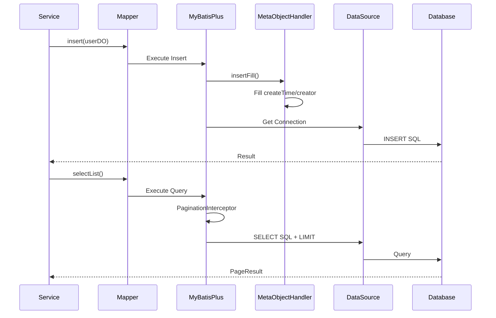

**字段自动填充机制：**

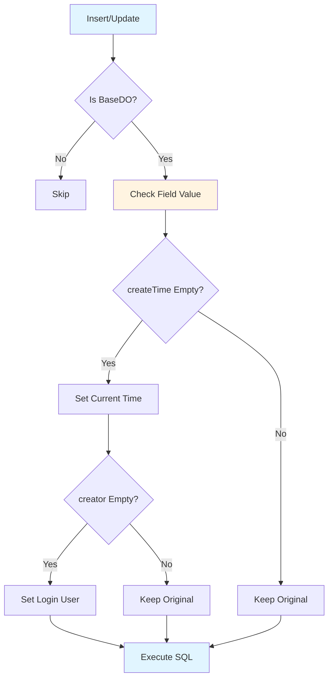

**多数据源切换机制：**

```mermaid
graph LR
    A[Service Method] --> B{@DS Annotation?}
    B -->|Yes| C[Set DataSource Key]
    B -->|No| D[Use Default]
    C --> E[DynamicDataSource]
    D --> E
    E --> F{Key = master?}
    E --> G{Key = slave?}
    F -->|Yes| H[Master DB]
    G -->|Yes| I[Slave DB]
    
    style A fill:#e1f5ff
    style E fill:#fff4e1
    style H fill:#ffe1e1
    style I fill:#e1f5ff
```

#### 配置说明

```yaml
# 数据源配置
spring:
  datasource:
    druid:
      # 主库配置
      master:
        url: jdbc:mysql://localhost:3306/yudao
        username: root
        password: password
        driver-class-name: com.mysql.cj.jdbc.Driver
      # 从库配置（可选）
      slave:
        url: jdbc:mysql://localhost:3307/yudao
        username: root
        password: password
        driver-class-name: com.mysql.cj.jdbc.Driver

# MyBatis Plus 配置
mybatis-plus:
  configuration:
    map-underscore-to-camel-case: true
    log-impl: org.apache.ibatis.logging.stdout.StdOutImpl
  global-config:
    db-config:
      id-type: auto
      logic-delete-field: deleted
      logic-delete-value: 1
      logic-not-delete-value: 0
```

#### 依赖引入

```xml
<dependency>
    <groupId>cn.iocoder.boot</groupId>
    <artifactId>yudao-spring-boot-starter-mybatis</artifactId>
</dependency>
```

---

### yudao-spring-boot-starter-redis（Redis 封装）

#### 作用

封装 Redis 和 Redisson，提供：
- **Redis 操作**：基于 Spring Data Redis 的 Redis 操作
- **分布式锁**：基于 Redisson 的分布式锁
- **缓存支持**：Spring Cache 集成
- **序列化配置**：统一的序列化配置

#### 核心功能

##### Redis 操作

```java
@Autowired
private StringRedisTemplate stringRedisTemplate;

public void set(String key, String value) {
    stringRedisTemplate.opsForValue().set(key, value);
}

public String get(String key) {
    return stringRedisTemplate.opsForValue().get(key);
}
```

##### 分布式锁

使用 `@Lock4j` 注解实现分布式锁：

```java
@Lock4j(keys = "#id", waitTime = 3, leaseTime = 30)
public void updateUser(Long id) {
    // 自动加锁，方法执行完后自动释放
    userService.updateUser(id);
}
```

##### 缓存支持

使用 `@Cacheable` 注解实现缓存：

```java
@Cacheable(value = "user", key = "#id")
public UserDO getUser(Long id) {
    return userMapper.selectById(id);
}
```

#### 实现原理

Redis Starter 基于 Spring Data Redis 和 Redisson 实现：

1. **自动配置**：配置 `RedisTemplate` 和 `StringRedisTemplate`，使用 Jackson 序列化
2. **分布式锁**：基于 Redisson 的 `RLock`，通过 AOP 拦截 `@Lock4j` 注解
3. **缓存支持**：Spring Cache 集成，`@Cacheable` 自动缓存方法返回值
4. **序列化**：统一使用 Jackson 序列化，支持 LocalDateTime 等类型

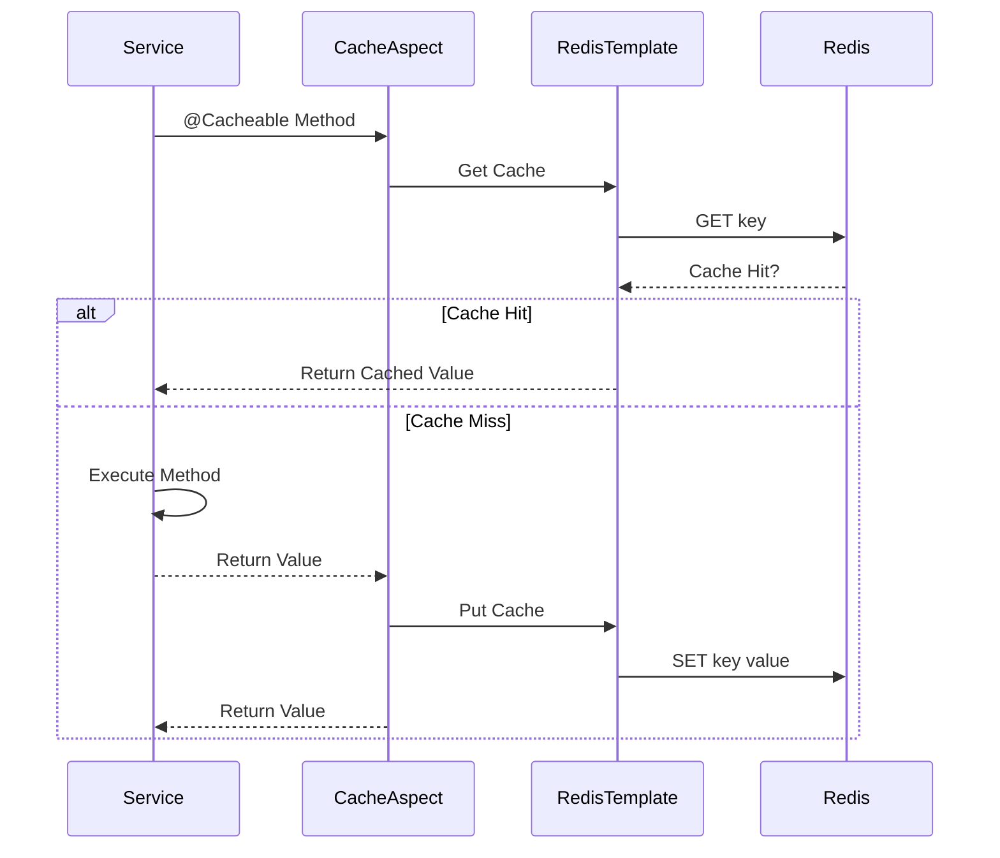

**分布式锁机制：**

```mermaid
graph TB
    A[@Lock4j Method] --> B[LockAspect]
    B --> C{Try Lock}
    C -->|Success| D[Execute Method]
    C -->|Failed| E{Wait Time?}
    E -->|Yes| F[Retry]
    E -->|No| G[Throw Exception]
    F --> C
    D --> H[Release Lock]
    H --> I[Return Result]
    
    style A fill:#e1f5ff
    style C fill:#ffe1e1
    style D fill:#fff4e1
    style H fill:#e1f5ff
```

#### 配置说明

```yaml
# Redis 配置
spring:
  data:
    redis:
      host: localhost
      port: 6379
      password: your-password
      database: 1
      timeout: 3000
      lettuce:
        pool:
          max-active: 8
          max-idle: 8
          min-idle: 0

# Redisson 配置
spring:
  redis:
    redisson:
      config: |
        singleServerConfig:
          address: "redis://localhost:6379"
          password: your-password
          database: 1
```

#### 依赖引入

```xml
<dependency>
    <groupId>cn.iocoder.boot</groupId>
    <artifactId>yudao-spring-boot-starter-redis</artifactId>
</dependency>
```

---

### yudao-spring-boot-starter-job（定时任务封装）

#### 作用

封装定时任务功能，基于 Quartz 和 Spring Async：
- **定时任务**：基于 Quartz 的定时任务管理
- **异步任务**：基于 Spring Async 的异步任务执行

#### 核心功能

##### 定时任务

使用 `@Scheduled` 注解定义定时任务：

```java
@Component
public class ScheduledTasks {
    
    @Scheduled(cron = "0 0 2 * * ?")  // 每天凌晨 2 点执行
    public void cleanExpiredData() {
        // 清理过期数据
    }
}
```

##### 异步任务

使用 `@Async` 注解执行异步任务：

```java
@Service
public class UserService {
    
    @Async
    public void sendEmailAsync(String email) {
        // 异步发送邮件
    }
}
```

#### 实现原理

Job Starter 基于 Quartz 和 Spring Async 实现：

1. **定时任务**：Quartz 调度器管理任务，支持 Cron 表达式
2. **异步任务**：Spring `@Async` 通过线程池执行异步方法
3. **任务持久化**：Quartz 支持 JDBC 存储，任务信息持久化到数据库

```mermaid
graph TB
    A[Quartz Scheduler] --> B[Job Store]
    B --> C[Trigger]
    C --> D[Job Execution]
    D --> E[Thread Pool]
    E --> F[Execute Job]
    
    G[@Async Method] --> H[Async Proxy]
    H --> I[TaskExecutor]
    I --> J[Thread Pool]
    J --> K[Execute Async]
    
    style A fill:#e1f5ff
    style G fill:#e1f5ff
    style F fill:#fff4e1
    style K fill:#fff4e1
```

#### 配置说明

```yaml
# Quartz 配置
spring:
  quartz:
    job-store-type: jdbc
    jdbc:
      initialize-schema: never
    properties:
      org:
        quartz:
          scheduler:
            instanceName: YudaoScheduler
            instanceId: AUTO
```

#### 依赖引入

```xml
<dependency>
    <groupId>cn.iocoder.boot</groupId>
    <artifactId>yudao-spring-boot-starter-job</artifactId>
</dependency>
```

---

### yudao-spring-boot-starter-mq（消息队列封装）

#### 作用

封装消息队列功能，支持：
- **Spring Event**：应用内事件发布/订阅
- **RocketMQ**：RocketMQ 消息队列
- **Kafka**：Kafka 消息队列
- **RabbitMQ**：RabbitMQ 消息队列

#### 核心功能

##### Spring Event

```java
// 发布事件
@Autowired
private ApplicationEventPublisher eventPublisher;

public void createUser(UserDO user) {
    userMapper.insert(user);
    // 发布用户创建事件
    eventPublisher.publishEvent(new UserCreateEvent(user));
}

// 监听事件
@EventListener
public void handleUserCreateEvent(UserCreateEvent event) {
    // 处理用户创建事件
}
```

##### RocketMQ

```java
@RocketMQMessageListener(
    topic = "user-topic",
    consumerGroup = "user-consumer-group"
)
public class UserMessageListener implements RocketMQListener<String> {
    @Override
    public void onMessage(String message) {
        // 处理消息
    }
}
```

#### 实现原理

MQ Starter 封装多种消息队列实现：

1. **Spring Event**：应用内事件，同步/异步发布订阅
2. **RocketMQ**：基于 RocketMQ Spring Boot Starter，自动注册消费者
3. **Kafka/RabbitMQ**：基于 Spring Kafka/AMQP，统一配置管理

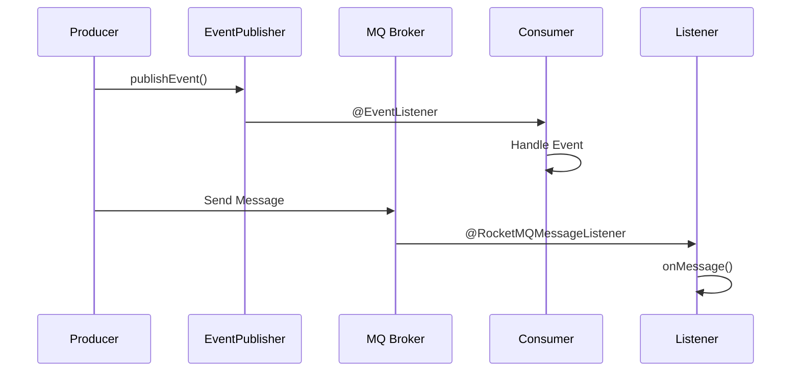

#### 配置说明

```yaml
# RocketMQ 配置
rocketmq:
  name-server: localhost:9876
  producer:
    group: yudao-producer-group
```

#### 依赖引入

```xml
<dependency>
    <groupId>cn.iocoder.boot</groupId>
    <artifactId>yudao-spring-boot-starter-mq</artifactId>
</dependency>
```

---

### yudao-spring-boot-starter-protection（服务保障封装）

#### 作用

提供服务保障功能：
- **分布式锁**：基于 Redisson 的分布式锁
- **幂等性**：防止重复提交
- **限流**：接口限流保护
- **熔断**：服务熔断保护
- **API 签名**：API 签名验证

#### 核心功能

##### 分布式锁

```java
@Lock4j(keys = "#id", waitTime = 3, leaseTime = 30)
public void updateUser(Long id) {
    // 自动加锁
}
```

##### 幂等性

使用 `@Idempotent` 注解防止重复提交：

```java
@Idempotent(timeout = 10, timeUnit = TimeUnit.SECONDS)
@PostMapping("/create")
public CommonResult<Long> createUser(@RequestBody UserCreateReqVO reqVO) {
    return CommonResult.success(userService.createUser(reqVO));
}
```

##### 限流

使用 `@RateLimiter` 注解实现限流：

```java
@RateLimiter(qps = 100)
@GetMapping("/list")
public CommonResult<List<UserVO>> list() {
    return CommonResult.success(userService.list());
}
```

#### 实现原理

Protection Starter 通过 AOP 和 Redis 实现服务保障：

1. **分布式锁**：基于 Redisson，使用 AOP 拦截 `@Lock4j`，自动加锁/释放
2. **幂等性**：使用 Redis 存储请求唯一标识，防止重复提交
3. **限流**：基于令牌桶或滑动窗口算法，使用 Redis 计数
4. **API 签名**：验证请求签名，防止篡改

```mermaid
graph TB
    A[Request] --> B{@Idempotent?}
    B -->|Yes| C[Check Redis Key]
    C --> D{Key Exists?}
    D -->|Yes| E[Return Cached Result]
    D -->|No| F[Set Redis Key]
    
    F --> G{@RateLimiter?}
    G -->|Yes| H[Check QPS]
    H --> I{QPS OK?}
    I -->|No| J[429 Too Many Requests]
    I -->|Yes| K{@Lock4j?}
    
    K -->|Yes| L[Acquire Lock]
    L --> M[Execute Method]
    M --> N[Release Lock]
    N --> O[Return Result]
    
    style B fill:#ffe1e1
    style G fill:#ffe1e1
    style K fill:#ffe1e1
    style M fill:#fff4e1
```

#### 配置说明

```yaml
# 分布式锁配置
lock4j:
  acquire-timeout: 3000
  expire: 30000
```

#### 依赖引入

```xml
<dependency>
    <groupId>cn.iocoder.boot</groupId>
    <artifactId>yudao-spring-boot-starter-protection</artifactId>
</dependency>
```

---

### yudao-spring-boot-starter-excel（Excel 封装）

#### 作用

封装 Excel 导入导出功能，基于 FastExcel：
- **Excel 导出**：将数据导出为 Excel 文件
- **Excel 导入**：从 Excel 文件导入数据
- **数据校验**：导入数据自动校验

#### 核心功能

##### Excel 导出

```java
@GetMapping("/export")
public void export(HttpServletResponse response) throws IOException {
    List<UserExportVO> list = userService.getExportList();
    ExcelUtils.write(response, "用户列表.xlsx", "用户", UserExportVO.class, list);
}
```

##### Excel 导入

```java
@PostMapping("/import")
public CommonResult<ExcelImportRespVO<UserImportVO>> importExcel(
        @RequestParam("file") MultipartFile file) throws Exception {
    List<UserImportVO> list = ExcelUtils.read(file, UserImportVO.class);
    return CommonResult.success(userService.importUsers(list));
}
```

#### 实现原理

Excel Starter 基于 FastExcel 实现：

1. **导出**：使用反射读取 VO 字段注解，生成 Excel 文件流
2. **导入**：解析 Excel 文件，使用反射和验证注解校验数据
3. **数据转换**：自动处理日期、数字等类型转换

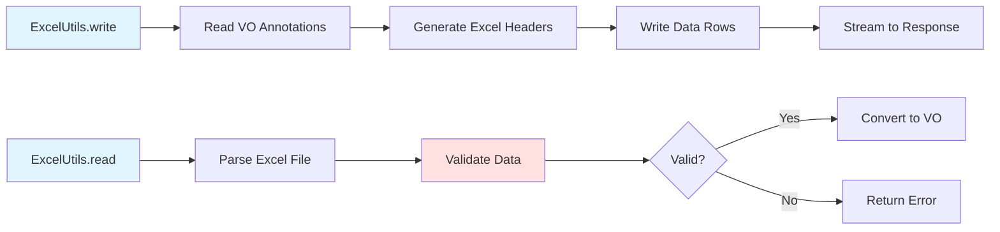

#### 配置说明

无需特殊配置，直接使用即可。

#### 依赖引入

```xml
<dependency>
    <groupId>cn.iocoder.boot</groupId>
    <artifactId>yudao-spring-boot-starter-excel</artifactId>
</dependency>
```

---

### yudao-spring-boot-starter-websocket（WebSocket 封装）

#### 作用

封装 WebSocket 功能，提供实时通信能力。

#### 核心功能

```java
@Component
@ServerEndpoint("/websocket/{userId}")
public class WebSocketServer {
    
    @OnOpen
    public void onOpen(@PathParam("userId") String userId) {
        // 连接建立
    }
    
    @OnMessage
    public void onMessage(String message) {
        // 接收消息
    }
    
    @OnClose
    public void onClose() {
        // 连接关闭
    }
}
```

#### 配置说明

```yaml
# WebSocket 配置
yudao:
  websocket:
    enable: true
```

#### 依赖引入

```xml
<dependency>
    <groupId>cn.iocoder.boot</groupId>
    <artifactId>yudao-spring-boot-starter-websocket</artifactId>
</dependency>
```

---

### yudao-spring-boot-starter-monitor（监控封装）

#### 作用

封装监控功能：
- **Spring Boot Admin**：应用监控
- **Actuator**：健康检查、指标监控
- **SkyWalking**：链路追踪

#### 配置说明

```yaml
# Actuator 配置
management:
  endpoints:
    web:
      exposure:
        include: health,info,metrics,prometheus
  endpoint:
    health:
      show-details: always

# SkyWalking 配置
skywalking:
  agent:
    service_name: yudao-server
    collector:
      backend_service: localhost:11800
```

#### 依赖引入

```xml
<dependency>
    <groupId>cn.iocoder.boot</groupId>
    <artifactId>yudao-spring-boot-starter-monitor</artifactId>
</dependency>
```

---

### yudao-spring-boot-starter-test（测试封装）

#### 作用

封装测试功能，提供：
- **单元测试工具**：测试工具类和 Mock 工具
- **集成测试支持**：数据库、Redis 等测试支持

#### 核心功能

```java
@SpringBootTest
@AutoConfigureMockMvc
class UserControllerTest {
    
    @Autowired
    private MockMvc mockMvc;
    
    @Test
    void testList() throws Exception {
        mockMvc.perform(get("/admin-api/system/user/list"))
            .andExpect(status().isOk());
    }
}
```

#### 依赖引入

```xml
<dependency>
    <groupId>cn.iocoder.boot</groupId>
    <artifactId>yudao-spring-boot-starter-test</artifactId>
    <scope>test</scope>
</dependency>
```

---

### yudao-spring-boot-starter-biz-tenant（多租户业务组件）

#### 作用

提供多租户（SaaS）支持：
- **租户隔离**：数据自动按租户隔离
- **租户切换**：动态切换租户上下文
- **租户管理**：租户信息管理

#### 核心功能

##### 租户隔离

实体类添加 `tenant_id` 字段，框架自动实现数据隔离：

```java
public class UserDO extends BaseDO {
    private Long tenantId;  // 租户ID，框架自动填充和过滤
    private String name;
}
```

##### 租户切换

```java
// 切换租户上下文
TenantContextHolder.setTenantId(1L);
// 后续所有数据库操作自动带上 tenant_id = 1 的条件
```

#### 实现原理

多租户组件通过 MyBatis Plus 的拦截器和 ThreadLocal 实现数据隔离：

1. **租户上下文**：`TenantContextHolder` 使用 ThreadLocal 存储当前租户ID
2. **SQL 拦截**：`TenantLineInnerInterceptor` 拦截 SQL，自动添加 `tenant_id` 条件
3. **字段填充**：`DefaultDBFieldHandler` 在插入时自动填充 `tenant_id`
4. **忽略表**：配置的忽略表不添加租户条件

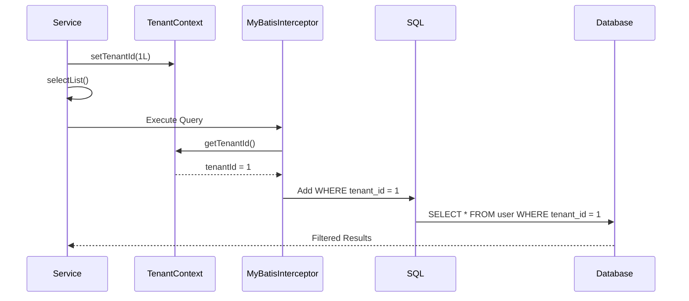

**租户隔离流程：**

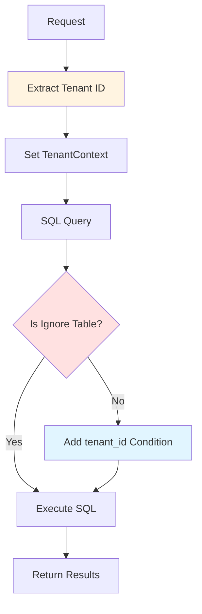

#### 配置说明

```yaml
yudao:
  tenant:
    enable: true
    ignore-tables:
      - system_tenant
      - system_tenant_package
```

#### 依赖引入

```xml
<dependency>
    <groupId>cn.iocoder.boot</groupId>
    <artifactId>yudao-spring-boot-starter-biz-tenant</artifactId>
</dependency>
```

---

### yudao-spring-boot-starter-biz-data-permission（数据权限业务组件）

#### 作用

提供数据权限控制：
- **数据范围控制**：根据用户权限过滤数据
- **部门数据权限**：按部门过滤数据
- **自定义数据权限**：支持自定义数据权限规则

#### 核心功能

使用 `@DataPermission` 注解实现数据权限：

```java
@DataPermission(enable = true)
public List<UserDO> selectList() {
    // 自动根据用户权限过滤数据
    return userMapper.selectList();
}
```

#### 实现原理

数据权限组件通过 MyBatis Plus 拦截器和 AOP 实现：

1. **权限上下文**：从 SecurityContext 获取当前用户权限信息
2. **SQL 拦截**：`DataPermissionDatabaseInterceptor` 拦截 SQL，根据权限范围添加条件
3. **权限范围**：支持全部、自定义、本部门、本部门及子部门、仅本人等范围
4. **表级控制**：通过配置指定哪些表需要数据权限控制

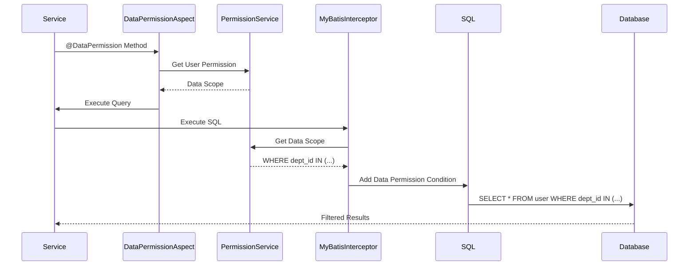

**数据权限范围：**

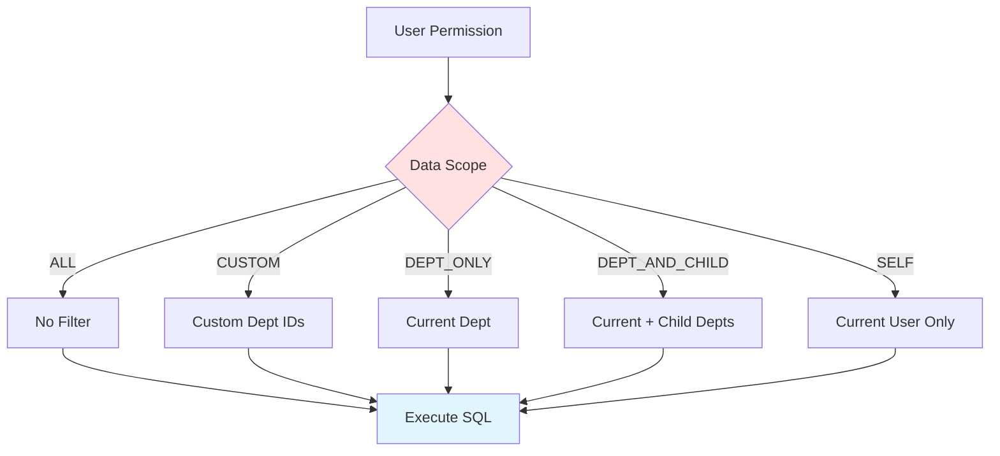

#### 配置说明

```yaml
yudao:
  data-permission:
    enable: true
```

#### 依赖引入

```xml
<dependency>
    <groupId>cn.iocoder.boot</groupId>
    <artifactId>yudao-spring-boot-starter-biz-data-permission</artifactId>
</dependency>
```

---

### yudao-spring-boot-starter-biz-ip（IP 解析业务组件）

#### 作用

提供 IP 地址解析功能：
- **IP 转地区**：根据 IP 地址解析所在地区
- **IP 库**：内置 IP2Region 数据库

#### 核心功能

```java
@Autowired
private IpUtils ipUtils;

public String getArea(String ip) {
    return ipUtils.getArea(ip);
}
```

#### 配置说明

无需配置，直接使用即可。

#### 依赖引入

```xml
<dependency>
    <groupId>cn.iocoder.boot</groupId>
    <artifactId>yudao-spring-boot-starter-biz-ip</artifactId>
</dependency>
```

---

## 快速开始

### 在业务模块中使用

#### 引入依赖

在业务模块的 `pom.xml` 中引入需要的 Starter：

```xml
<dependencies>
    <!-- Web 框架 -->
    <dependency>
        <groupId>cn.iocoder.boot</groupId>
        <artifactId>yudao-spring-boot-starter-web</artifactId>
    </dependency>
    
    <!-- 安全框架 -->
    <dependency>
        <groupId>cn.iocoder.boot</groupId>
        <artifactId>yudao-spring-boot-starter-security</artifactId>
    </dependency>
    
    <!-- MyBatis -->
    <dependency>
        <groupId>cn.iocoder.boot</groupId>
        <artifactId>yudao-spring-boot-starter-mybatis</artifactId>
    </dependency>
    
    <!-- Redis -->
    <dependency>
        <groupId>cn.iocoder.boot</groupId>
        <artifactId>yudao-spring-boot-starter-redis</artifactId>
    </dependency>
</dependencies>
```

#### 配置属性

在 `application.yaml` 中配置相关属性（参考各模块的配置说明）。

#### 使用功能

直接使用各模块提供的功能，无需额外配置（自动配置已生效）。

### 模块依赖关系

```
yudao-common (基础模块)
    ↑
    ├── yudao-spring-boot-starter-web
    │   └── yudao-spring-boot-starter-security
    │       └── yudao-spring-boot-starter-biz-tenant
    │       └── yudao-spring-boot-starter-biz-data-permission
    ├── yudao-spring-boot-starter-mybatis
    ├── yudao-spring-boot-starter-redis
    ├── yudao-spring-boot-starter-job
    ├── yudao-spring-boot-starter-mq
    ├── yudao-spring-boot-starter-excel
    ├── yudao-spring-boot-starter-websocket
    ├── yudao-spring-boot-starter-monitor
    ├── yudao-spring-boot-starter-protection
    └── yudao-spring-boot-starter-test
```

## 最佳实践

### 配置管理

1. **环境隔离**：使用 Spring Profile 区分开发、测试、生产环境
2. **配置集中**：相关配置集中在 `application.yaml` 中
3. **敏感信息**：敏感配置使用环境变量或配置中心

### 开发规范

1. **统一返回**：所有 API 使用 `CommonResult` 统一返回
2. **异常处理**：使用 `ServiceException` 抛出业务异常
3. **权限控制**：使用 `@PreAuthorize` 进行权限校验
4. **操作日志**：使用 `@OperateLog` 记录操作日志

## 常见问题

### 自动配置不生效

**问题**：引入 Starter 后，自动配置不生效。

**解决**：
1. 检查 `META-INF/spring/org.springframework.boot.autoconfigure.AutoConfiguration.imports` 文件是否存在
2. 检查自动配置类是否被 Spring Boot 扫描到
3. 检查是否有 `@SpringBootApplication` 注解

### 配置不生效

**问题**：配置属性不生效。

**解决**：
1. 检查配置属性类是否有 `@ConfigurationProperties` 注解
2. 检查配置前缀是否正确
3. 检查配置是否在正确的配置文件中

## 总结

`yudao-framework` 是芋道框架的技术基础：

- **技术组件封装**：将 MyBatis、Redis、Security 等组件封装成 Starter
- **自动配置**：基于 Spring Boot 自动配置机制，零配置使用
- **统一规范**：提供统一的 API 和工具类，规范开发方式
- **业务组件**：封装多租户、数据权限等业务通用能力

通过这个模块，开发者可以：
1. 快速搭建项目基础架构
2. 统一技术栈和开发规范
3. 专注于业务逻辑开发
4. 提高开发效率和代码质量

## 附录：模块清单

| 模块名 | 类型 | 作用 |
|--------|------|------|
| yudao-common | 基础模块 | 通用类、工具类、异常类 |
| yudao-spring-boot-starter-web | 框架组件 | Web 框架封装 |
| yudao-spring-boot-starter-security | 框架组件 | 安全框架封装 |
| yudao-spring-boot-starter-mybatis | 框架组件 | MyBatis 封装 |
| yudao-spring-boot-starter-redis | 框架组件 | Redis 封装 |
| yudao-spring-boot-starter-websocket | 框架组件 | WebSocket 封装 |
| yudao-spring-boot-starter-job | 框架组件 | 定时任务封装 |
| yudao-spring-boot-starter-mq | 框架组件 | 消息队列封装 |
| yudao-spring-boot-starter-monitor | 框架组件 | 监控封装 |
| yudao-spring-boot-starter-protection | 框架组件 | 服务保障封装 |
| yudao-spring-boot-starter-excel | 框架组件 | Excel 封装 |
| yudao-spring-boot-starter-test | 框架组件 | 测试封装 |
| yudao-spring-boot-starter-biz-tenant | 业务组件 | 多租户支持 |
| yudao-spring-boot-starter-biz-data-permission | 业务组件 | 数据权限控制 |
| yudao-spring-boot-starter-biz-ip | 业务组件 | IP 解析 |

---

**文档版本**：v1.0  
**最后更新**：2025-01-XX  
**维护者**：芋道开发团队